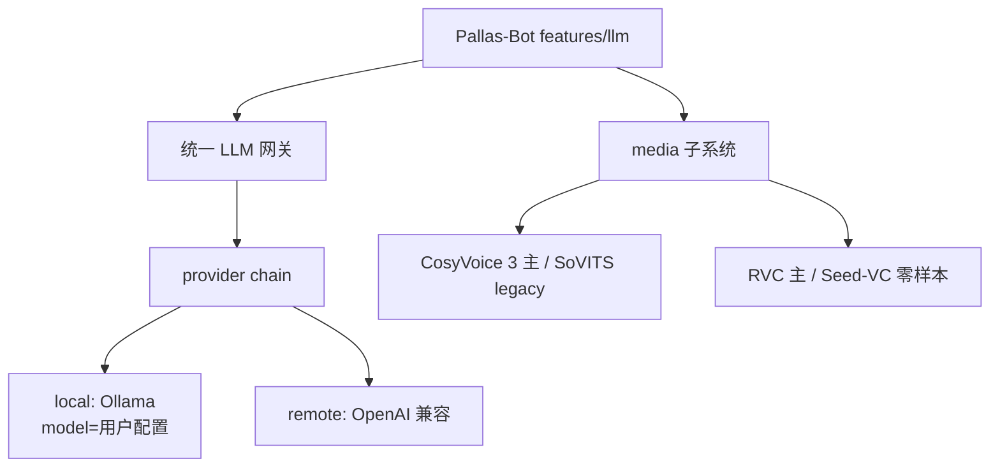

# 本地模型选型笔记

> **基准日期：2026-06** · **性质：历史选型快照，不是产品默认。**  
> Chat LLM 走统一网关 + provider chain；TTS / sing 为独立 media 子系统。  
> 现行部署见 [Deployment.md](../Deployment.md)。

## 2026 外部基准（选型依据）

本节记录 **2026 年 6 月** 查阅的公开资料与社区状态，供后续 PR 对照；**不是** Pallas 实测报告。

| 领域 | 2026 年前后主流 | 与 Pallas 现状差距 | 参考 |
| --- | --- | --- | --- |
| **本地 Chat** | **Qwen3**（Ollama `qwen3:8b` / `14b`，可 `/no_think` 闲聊）为主力；Qwen2.5 仍可用于低显存 | 默认仍 `qwen2.5:7b`；RWKV 双栈 | [Ollama thinking 文档](https://docs.ollama.com/capabilities/thinking)、2026 Ollama 选型综述 |
| **TTS** | **CosyVoice 3**（`Fun-CosyVoice3-0.5B`，2025-12 权重）；**GPT-SoVITS v4**（2025-06，修 v3 金属音、原生 48k） | 内嵌集成仍为 **v2** + 中→日绕路 | [CosyVoice 3 论文](https://arxiv.org/html/2505.17589v2)、[GPT-SoVITS releases](https://github.com/RVC-Boss/GPT-SoVITS) |
| **SVC 翻唱** | **RVC v2** 仍为「按角色训练」生态最大；**Seed-VC** 零样本 SVC 在 SECS/CER 上优于 per-speaker RVCv2，DNSMOS 略低 | **DDSP-SVC reflow**，生态与上限均落后 | [Seed-VC EVAL vs RVCv2](https://github.com/Plachtaa/seed-vc/blob/main/EVAL.md)、[arXiv:2411.09943](https://arxiv.org/pdf/2411.09943) |
| **RVC 官方库** | `Retrieval-based-Voice-Conversion` 新库化（WebUI 与 library 分叉） | 未接入 | [RVC-Project/Retrieval-based-Voice-Conversion](https://github.com/RVC-Project/Retrieval-based-Voice-Conversion) |

**结论时效**：上表为 **2026-06 规划输入**；M 阶段落地前须对 **Pallas 固定测试集** 复测（见文末「Pallas 待测」）。

---

## 现状快照（仓库 2026-06-16）

| 能力 | 当前实现 | 依赖 / 资源 | 4.0 说明 |
| --- | --- | --- | --- |
| **LLM 多轮闲聊** | 本地/远端 provider + Celery | `LLM_*`、Redis | 4.0 **新主路径**；Bot 开 `LLM_CHAT_ENABLED` |
| **酒后聊天（legacy）** | **RWKV v7** | `chat` group | **保留**；`POST /api/chat`，免 Ollama |
| **酒后/闲聊（4.0）** | 同上 LLM 栈 | `mode=drunk` metadata | Bot 4.0 默认走 LLM；与 RWKV 并存 |
| **TTS** | 内嵌 GPT-SoVITS **`version: v2`** | `tts` group | **升级时须保持可用** |
| **唱歌 SVC** | demucs + **DDSP-SVC reflow** | `sing` group | **升级时须保持可用** |
| **运行时** | Python **3.12** | 与主仓对齐 | 已升级 |

---

## 4.0 目标形态（2026 版）



---

## 1. Chat LLM（2026）

### 4.0 平台职责（不替用户选模型）

| 平台交付 | 用户自行决定 |
| --- | --- |
| 统一 Chat API + Ollama local 适配 + OpenAI 兼容 remote | `local_only` / `remote_only` / `chain` |
| 透传 `model`、`think`、超时、并发 | Ollama tag 或 remote model id |
| `/health`、模型列表（Ollama tags / remote 探测） | 是否 pull Hermes、Qwen3、distill、MoE 等 |
| 退役 RWKV，单栈 LLM | 显存不够就用小模型或改 remote |

**本地标准答案：Ollama。** 不为主流每个系列写专用 agent；`hermes3:8b`、`qwen3:4b`、`deepseek-r1:8b`、`gemma3:4b` 等均为同一接口下的不同 `model` 字符串。Deployment 可提供 **示例对照表**（VRAM ↔ 参数量），**不设产品默认模型**。

### RWKV 退役（不变）

- `POST /api/chat/*` → deprecated → 移除 `chat` group 与 `resource/chat/models`。
- 酒后聊天 = 统一 Chat API + `compile_persona_prompt` + 高温度 preset。

---

## 2. TTS（2026）

### 2026 对比摘要

| 引擎 | 2026 定位 | Pallas 4.0 |
| --- | --- | --- |
| **CosyVoice 3** | 中文/多语 in-the-wild、零样本克隆；CV3-Eval 上整体优于 GPT-SoVITS 与 CosyVoice 2 | **4.0 中文 TTS 默认引擎** |
| **GPT-SoVITS v4** | 社区角色声仍多；v4 修 v3 电音、48k 输出（2025-06） | **legacy adapter**；已有角色权重可过渡 |
| **内嵌 v2** | 2024 代集成 | **仅兼容期**，不新增功能 |

### 4.0 路线

| 阶段 | 交付 |
| --- | --- |
| **M2a** | `TtsEngine` 抽象；去掉默认中→日；`voices/pallas_zh` 配置化 |
| **M2b** | 接入 **CosyVoice 3**（`Fun-CosyVoice3-0.5B` 或后续 2512_RL 权重） |
| **M2c** | 可选 **GPT-SoVITS v4** adapter（复用社区角色 ckpt） |
| **远期** | `remote_tts` API 备线 |

---

## 3. Sing / SVC（2026）

### 2026 结论：不是「RVC 全面碾压一切」

| 场景 | 2026 推荐 | 依据 |
| --- | --- | --- |
| **核心角色（pallas 等）长期音质** | **RVC v2**（按角色训练） | 翻唱圈模型/教程最多；M4Singer 评测中 **DNSMOS 音质略优于 Seed-VC** |
| **快速加新 speaker、少样本** | **Seed-VC**（零样本 / 少样本） | 同评测 **SECS↑、CER↓** 优于 per-speaker RVCv2；无需先训 `.pth` |
| **现有 DDSP `.pt`** | legacy 兼容 | 4.0.0 可保留 1 个版本窗口 |
| **DDSP 作为 4.0 默认** | **否** | 2026 社区与公开对比中仍为轻量备选，非质量首选 |

### 4.0 双引擎策略

```yaml
media:
  sing:
    default_engine: rvc              # 已训练角色、正式翻唱
    zero_shot_engine: seed_vc        # 新 speaker 试验 / 无 ckpt
    legacy_engine: ddsp_svc          # 兼容至 4.0.x
```

| 阶段 | 交付 |
| --- | --- |
| **M3a** | `SvcEngine` 抽象；去掉裸 `os.system` |
| **M3b** | **pallas** 等核心 speaker **RVC v2** 重训 |
| **M3c** | 可选 **Seed-VC** 路径（WebUI 选「零样本试音」） |
| **M3d** | DDSP 标 deprecated，给出截止版本 |

### demucs

- 4.0 可继续 **htdemucs**；分离非阻塞，SVC 引擎切换后再测是否换更快 separator。

---

## 4. 统一配置（2026 示意）

```yaml
llm:
  mode: local_only              # 或 remote_only | chain
  local:
    type: ollama
    model: ${OLLAMA_MODEL}      # 用户自选 tag
  remote:
    type: openai_compatible
    model: ${LLM_REMOTE_MODEL}

media:
  tts:
    engine: ${TTS_ENGINE}       # 用户/站点选引擎，见 M2
  sing:
    engine: ${SVC_ENGINE}       # 用户/站点选引擎，见 M3
  gpu_policy: serialize
```

---

## 5. 实施阶段（2026 排期）

| 阶段 | 时间目标 | 交付 |
| --- | --- | --- |
| **A1–A3** | 4.0.0 | 统一 Chat API；Ollama + remote；用户可选 mode/chain |
| **M1** | 4.0.0 | RWKV 移除 |
| **M2** | 4.0.0–4.0.x | TTS 引擎抽象 + 可选引擎接入 |
| **M3** | 4.0.x | SVC 引擎抽象 + 可选 RVC / Seed-VC；DDSP deprecated |
| **M4** | 4.0.x | Python 3.12；镜像减重 |

---

## 6. Pallas 待测（落地前必做）

固定 **1 首 NCM 片段 × pallas speaker × 同一 key**，记录日期与版本：

| 对比项 | 引擎 A | 引擎 B | 记录 |
| --- | --- | --- | --- |
| SVC 音质 / 像不像 | DDSP（现网） | RVC v2 | 主观 + SECS 可选 |
| SVC 零样本 | RVC（现 ckpt） | Seed-VC | 同上 |
| TTS 中文自然度 | GPT-SoVITS v2（现网） | CosyVoice 3 | MOS |
| Chat 角色感 | RWKV（现网） | Qwen3 `/no_think` + persona | 盲测 |

未测前，本文 **SVC/TTS 排序** 仅作 2026 公开资料 + 工程判断，不作为上线验收依据。

---

## 7. 验收

- [ ] 用户可配置 **local_only / remote_only / chain**，无写死默认模型
- [ ] Ollama `model` 与 remote `model` 均可热改
- [ ] 无 RWKV 模型与 `chat` API
- [ ] TTS 默认 **CosyVoice 3** 或文档声明 M2 分期
- [ ] sing 核心 speaker 有 **RVC** 权重；Seed-VC 可选
- [ ] DDSP 有 deprecated 与截止版本
- [ ] `/health` 暴露 llm / tts / svc 引擎与模型版本
- [ ] Pallas 待测表至少完成一轮填表

## 相关

- [Deployment.md](../Deployment.md)
- [platform-roadmap.md](platform-roadmap.md)
- [runtime.md](runtime.md)
