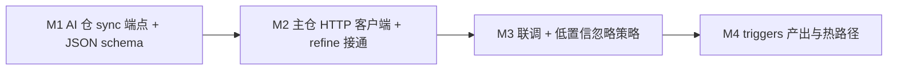

# Persona 情感 Refine · AI 仓接口设计

> **目标版本：4.0** · 与主仓 `feat/4.0-persona` 对齐。  
> 主仓负责统计基线 + 调用；**本仓负责 JSON-only 批次分析**（随 LLM 总闸默认开，不走接话热路径）。

## 背景

主仓 `group_style_refresh`（约 20min 批次）已产出：

| 字段 | 来源 |
| --- | --- |
| `style_profile.raw.affect_tone` | 启发式词表 + 标点（`resource/persona/affect_lexicon_baseline.txt`） |
| `style_profile.derived.warmth_bias` / `assertiveness_bias` | 统计推导 |
| `compile_group_style_snapshot().hints` | 供 LLM 阅读的摘要 |

`LLM_AFFECT_REFINE_ENABLED=1` 时，refresh 在写库前调用本接口，将 **delta** 合并进 `style_profile.sample.affect_refine`，并可选返回 **triggers**（二期）。

## 职责切分

| 层 | Pallas-Bot | Pallas-Bot-AI |
| --- | --- | --- |
| 词表 / civility 扫描 | ✅ `affect_tone_scan` | — |
| warmth/assertiveness 基线 | ✅ `derive_group_affect_bias` | — |
| 批次 LLM 微调 delta | 调用 + merge | ✅ 推理 + JSON 校验 |
| trigger 热路径命中 | ✅ 二期 `affect_triggers` | 仅产出 phrase 建议 |
| 接话 scorer | ✅ 读合并后 persona | — |

## API 契约（建议）

### `POST /api/persona/affect-refine`

**同步** JSON 请求/响应（批次后台任务内调用，无需 Celery 回调）。

#### Request

```json
{
  "group_id": 123456789,
  "profile": {
    "sample": {
      "message_count": 420,
      "answer_count": 85,
      "window_hours": 168
    },
    "raw": {
      "repeat_chain_rate": 0.18,
      "local_answer_ratio": 0.2,
      "affect_tone": {
        "civility_score": -0.12,
        "harsh_msg_ratio": 0.08,
        "polite_msg_ratio": 0.05,
        "punct_aggression_avg": 0.11
      }
    },
    "derived": {
      "warmth_bias": 0.05,
      "assertiveness_bias": 0.12,
      "length_pref": "short",
      "chaos_bias": 0.18
    }
  },
  "hints": ["群消息偏短", "复读链与短句常见"],
  "message_samples": [
    "草这也太离谱了",
    "谢谢大佬",
    "？？？"
  ]
}
```

约束：

- `message_samples`：主仓脱敏后最多 **12** 条、每条 ≤ **120** 字符；不含 QQ/群号。
- `profile` 为 refresh 当下快照，AI **不**回写整份 profile。

#### Response（200）

```json
{
  "warmth_delta": 0.03,
  "assertiveness_delta": 0.08,
  "confidence": 0.65,
  "summary": "语气偏直接、短句复读多，宜略提高 assertiveness",
  "triggers": []
}
```

| 字段 | 范围 | 说明 |
| --- | --- | --- |
| `warmth_delta` | [-0.5, 0.5] | 叠加到 `derived.warmth_bias` |
| `assertiveness_delta` | [-0.5, 0.5] | 叠加到 `derived.assertiveness_bias` |
| `confidence` | [0, 1] | 低置信时主仓可忽略 delta |
| `summary` | ≤ 256 字 | 写入 `affect_refine.summary`，供 debug / WebUI |
| `triggers` | 二期 | 见下节 |

失败时 HTTP 4xx/5xx 或 `{ "error": "..." }`；主仓 **回退** 为 `source=none`、delta=0。

### 二期：`triggers` 元素

```json
{
  "phrase": "？？？",
  "warmth_delta": -0.02,
  "assertiveness_delta": 0.04,
  "ttl_hours": 168
}
```

主仓存入 `style_profile.sample.affect_triggers`，热路径子串命中累加 + decay（**不在 AI 仓执行**）。

## 主仓 merge 结果

写入 `style_profile.sample.affect_refine`：

```json
{
  "source": "llm",
  "warmth_delta": 0.03,
  "assertiveness_delta": 0.08,
  "confidence": 0.65,
  "summary": "...",
  "updated_at": 1710000000
}
```

`merge_affect_refine_into_profile()` 已将 delta 叠加进 `derived.*_bias`（已有实现）。

## AI 仓实现要点

### 目录建议

```
app/api/endpoints/persona_affect.py   # 路由
app/schemas/persona_affect.py         # Pydantic 请求/响应
app/services/persona_affect.py        # 组 prompt、调 Ollama、解析 JSON
app/prompts/persona_affect_refine.txt # system 模板（JSON only）
```

### Prompt 原则

1. **只输出 JSON**，禁止 markdown 围栏。
2. 输入：`hints` + `affect_tone` 数值 + 脱敏样本；**不要**要求模型复述脏词列表。
3. 任务：在统计基线基础上给 **小幅 delta**（典型 |delta| ≤ 0.15），避免与启发式重复计权。
4. `temperature` 低（0.2–0.4）；模型由 env 配置，**不写死** tag。

### Provider

- 同步调用本地后端 `local_backend_chat_url()`（与 LLM Celery 路径共用 runtime 配置）。
- 4.0+ 可改为经统一 Chat API + `response_format: json_object`。

### 配置（AI 仓 `.env` / `pallas.toml`）

| 键 | 默认 | 说明 |
| --- | --- | --- |
| `PERSONA_AFFECT_REFINE_ENABLED` | `true` | AI 仓侧总开关（双保险；总闸关时 endpoint 仍可用 heuristic） |
| `PERSONA_AFFECT_REFINE_MODEL` | 空→全局 LLM 默认 | 分析用模型 |
| `PERSONA_AFFECT_REFINE_TIMEOUT_SEC` | `25` | 同步超时 |
| `PERSONA_AFFECT_REFINE_MAX_SAMPLES` | `12` | 与主仓对齐 |

主仓已有：`LLM_AFFECT_REFINE_ENABLED`（默认开，总闸关时不调用）。

## 主仓调用点（已实现钩子）

`src/features/persona/group_style_refresh.py` → `refine_group_style_affect()`  
待补：`features/llm` 或专用 `affect_refine_client.py` 发 HTTP。

```python
# 伪代码
if not llm_affect_refine_enabled():
    return merge_affect_refine_into_profile(profile, empty_affect_refine())
payload = build_affect_refine_request(profile, group_id=group_id, samples=...)
result = await post_affect_refine(payload)  # 失败 → empty
return merge_affect_refine_into_profile(profile, result)
```

`message_samples` 来源：refresh 时从 `message_repo.find_recent_in_group` 取 plain_text（与 profiler 同窗口），条数/长度在主仓截断。

## 实施顺序



| 步 | 交付 | 默认 |
| --- | --- | --- |
| M1 | `/api/persona/affect-refine` + pytest | 关 |
| M2 | `affect_refine.py` 真实 HTTP | 关 |
| M3 | `confidence < 0.4` 时不合并 delta | — |
| M4 | triggers 存储 + decay + scorer 内容加权 | 关 |

主仓交付项与验收见 [Pallas-Bot · llm-efficiency-roadmap A6.5–A6.6](https://github.com/PallasBot/Pallas-Bot/blob/main/docs/architecture/llm-efficiency-roadmap.md#phase-a6--情感与主动行为后置)。

## 验收

- [ ] 开关关：与现网一致，无额外 HTTP
- [ ] 开关开 + AI 可达：refresh 后 `affect_refine.source=llm`
- [ ] AI 超时/非法 JSON：refresh 仍成功，delta=0
- [ ] scorer / compile_persona_prompt 行为随 merged bias 变化可观测
- [ ] 样本中无 QQ、群号、token

## 相关

- 主仓 [persona-llm-roadmap](https://github.com/PallasBot/Pallas-Bot/blob/feat/4.0-persona/docs/architecture/persona-llm-roadmap.md)
- 主仓 [pallas-ai-service](https://github.com/PallasBot/Pallas-Bot/blob/feat/4.0-persona/docs/architecture/pallas-ai-service.md)
- 参考思路：[nonebot-plugin-nyaturingtest](https://github.com/shadow3aaa/nonebot-plugin-nyaturingtest)（VAD + 批次情感；Pallas 不照搬 per-message LLM）

## 与 Chat 能力归一化（4.0 大整合方向）

AI 仓 **可以且建议** 做一轮大整合，但应分「运行时归一」与「玩法保留」两层：

| 能力 | 现况 | 4.0 目标 |
| --- | --- | --- |
| `@牛牛` 闲聊 | 主仓 `compile_persona_prompt` + AI `/api/ollama/chat` | 统一 `POST /v1/chat/completions` + `mode=normal` |
| 酒后聊天 | 独立 RWKV `/api/chat` + 固定 INIT_PROMPT | **同一 Chat API** + `mode=drunk` preset（高 temperature + 醉酒 system 叠加） |
| persona affect refine | 本端点（批次 JSON） | 保持独立轻量路由，不走 Celery |
| sing / draw / tts | 专用 GPU 任务 | 仍独立子路由（多模态/音频） |

**酒后 ≈ 平常 @**：主仓侧已是 `features/llm` + persona；差异主要在 **preset**：

```json
{
  "mode": "drunk",
  "temperature": 1.0,
  "system_overlay": "你现在微醺，语气更随意、更爱调侃，但仍保持帕拉斯人设…"
}
```

RWKV 路径可标记 **legacy**，兼容期保留，新部署默认走 Ollama/OpenAI 兼容链。

**Dream 插件**：主体是 **语料漂移 / 历史复读**（非 LLM），与 Chat **不应硬合并**：

- 平时：本地 message 采样 + echo，零 LLM 成本
- 可选进阶：醉酒 dream 分支增加 `mode=drunk_dream` 生成一句「梦话」，失败仍回退语料 echo
- 会话存储：**不与** @牛牛 用户会话混用（dream 无多轮对话语义）

整合顺序建议：**统一 Chat 网关 → 酒后 preset → affect-refine（本 PR）→ dream 可选 LLM 点缀**。
